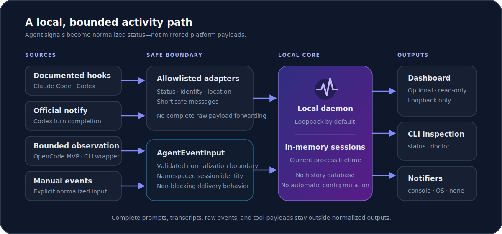

<p align="center">
  
</p>

<h1 align="center">AgentPulse</h1>

<p align="center"><strong>Universal activity monitor for AI coding agents.</strong></p>

<p align="center">
  <a href="README.md">English</a>
  ·
  <a href="README.zh-CN.md">简体中文</a>
</p>

<p align="center">
  <a href="https://github.com/QianQIUlp/AgentPulse/releases/tag/v0.3.0"></a>
  
  <a href="LICENSE"></a>
  <a href="https://github.com/QianQIUlp/AgentPulse/actions/workflows/ci.yml"></a>
</p>

AgentPulse is a local activity hub that normalizes supported AI coding-agent
events into one current view, with safe notifications, CLI inspection, and an
optional read-only dashboard.

<p align="center">
  
</p>

## Feature Overview

- **One local activity view:** aggregate supported agent lifecycle events into
  AgentPulse-owned, namespaced sessions.
- **Status-first dashboard:** inspect current work, action-needed states,
  failures, stale activity, setup snippets, and basic doctor output.
- **Flexible notifications:** select console, OS, or no-op output without
  coupling notification failures to event ingestion.
- **Safe adapter boundary:** translate only allowlisted status, identity,
  location, and short safe-message fields.
- **Non-blocking integrations:** malformed input and daemon failures degrade
  safely so hook and notify workflows can continue.
- **Standalone preview builds:** run the supported Linux x64 and Windows x64
  artifacts without installing Node.js, npm, or pnpm.

The browser dashboard is opt-in, read-only, and restricted to loopback. It
reflects only the current daemon's in-memory state.

## Supported Integrations and Levels

AgentPulse distinguishes verified interfaces from experiments and bounded
fallbacks:

| Integration              | Level                             | Current boundary                                                                  |
| ------------------------ | --------------------------------- | --------------------------------------------------------------------------------- |
| Claude Code              | Precise                           | Documented lifecycle hooks; observation only                                      |
| Codex hooks              | Precise lifecycle                 | Documented session, prompt, tool, permission, and stop events after user trust    |
| Codex `notify`           | Narrow official                   | Maps the documented `agent-turn-complete` notification                            |
| OpenCode                 | Implemented, verification pending | Documented local plugin events; not yet labeled supported                         |
| Cursor                   | Manual / Experimental bridge      | Explicit terminal or task commands only; no automatic lifecycle hook is claimed   |
| Codex Desktop            | Experimental                      | Reuses Codex hooks with an explicit desktop surface; real verification is pending |
| Antigravity              | Research-only                     | Sanitized manual probe scaffolding, not a supported adapter                       |
| Generic CLI wrapper      | Best-effort                       | Observes only the process started by `agentpulse run`                             |
| Manual normalized events | Manual                            | Caller-supplied events through `agentpulse emit`                                  |

Codex hooks are observation-only. AgentPulse does not return permission
decisions, context, updated tool input, or turn-control output.

See [integration boundaries](docs/integration-boundaries.md) for the exact
event and data contracts.

## Quick Start

The recommended user path is a standalone
[AgentPulse v0.3.0 Preview](https://github.com/QianQIUlp/AgentPulse/releases/tag/v0.3.0)
binary:

| Platform    | v0.3.0 Preview status                                |
| ----------- | ---------------------------------------------------- |
| Linux x64   | Supported and verified by CI standalone smoke tests  |
| Windows x64 | Supported and verified by CI standalone smoke tests  |
| macOS       | Planned / unverified; no supported binary is claimed |

1. Download the archive and matching checksum:

   - Linux:
     [`agentpulse-v0.3.0-linux-x64.tar.gz`](https://github.com/QianQIUlp/AgentPulse/releases/download/v0.3.0/agentpulse-v0.3.0-linux-x64.tar.gz)
     and
     [`agentpulse-v0.3.0-linux-x64.tar.gz.sha256`](https://github.com/QianQIUlp/AgentPulse/releases/download/v0.3.0/agentpulse-v0.3.0-linux-x64.tar.gz.sha256)
   - Windows:
     [`agentpulse-v0.3.0-windows-x64.zip`](https://github.com/QianQIUlp/AgentPulse/releases/download/v0.3.0/agentpulse-v0.3.0-windows-x64.zip)
     and
     [`agentpulse-v0.3.0-windows-x64.zip.sha256`](https://github.com/QianQIUlp/AgentPulse/releases/download/v0.3.0/agentpulse-v0.3.0-windows-x64.zip.sha256)

2. Verify and extract it.

   Linux:

   ```bash
   sha256sum --check agentpulse-v0.3.0-linux-x64.tar.gz.sha256
   tar -xzf agentpulse-v0.3.0-linux-x64.tar.gz
   cd agentpulse-v0.3.0-linux-x64
   ```

   Windows PowerShell:

   ```powershell
   $expected = (Get-Content .\agentpulse-v0.3.0-windows-x64.zip.sha256).Split()[0]
   $actual = (Get-FileHash .\agentpulse-v0.3.0-windows-x64.zip -Algorithm SHA256).Hash
   if ($actual.ToLower() -ne $expected.ToLower()) { throw "Checksum mismatch" }
   Expand-Archive .\agentpulse-v0.3.0-windows-x64.zip -DestinationPath .\agentpulse-v0.3.0-windows-x64
   Set-Location .\agentpulse-v0.3.0-windows-x64
   ```

3. Start the daemon with the optional dashboard:

   ```bash
   ./agentpulse daemon --dashboard
   ```

   On Windows, use:

   ```powershell
   .\agentpulse.exe daemon --dashboard
   ```

4. Open the printed local URL, normally
   `http://127.0.0.1:3768/dashboard`, then verify the installation:

   ```bash
   ./agentpulse doctor
   ./agentpulse status
   ```

For a standalone binary, `doctor` reports that source-build checks are not
required. The archive's `BUILD-INFO.txt` records its build runtime, commit,
platform, and architecture. See [install without Node](docs/install-without-node.md)
and the [dashboard guide](docs/dashboard.md). Developers working with the
experimental Electron status window should use the
[companion surface guide](docs/companion-surface.md).

Commands below use `agentpulse` on `PATH`. When running directly from an
extracted Linux archive, replace it with `./agentpulse`; on Windows, use
`.\agentpulse.exe`.

## Platform Setup

AgentPulse prints reviewable, mergeable setup fragments:

```bash
agentpulse setup claude-code --print
agentpulse setup codex --print
agentpulse setup codex-hooks --print
agentpulse setup cursor --print
agentpulse setup opencode --print
```

These commands never read or modify user configuration. By default, generated
commands include the current standalone binary path or the source-mode Node.js
and CLI paths. Use `--binary agentpulse` only when explicitly selecting `PATH`
mode.

Follow the platform-specific merge and verification steps:

- [Claude Code setup](docs/setup-claude-code.md)
- [Codex notify setup](docs/setup-codex.md)
- [Codex hooks setup](docs/setup-codex-hooks.md)
- [Cursor manual bridge](docs/cursor.md)
- [OpenCode plugin MVP](docs/opencode.md)

Hook-style Codex and OpenCode ingest remains quiet and non-blocking on
malformed input or daemon failure.

### Everyday CLI

Choose a notifier when starting the daemon:

```bash
agentpulse daemon --notifier console
agentpulse daemon --notifier os
agentpulse daemon --notifier none
```

The default is `console`. On Linux, OS notifications require a graphical
session and `notify-send`; failures do not stop ingestion.

Inspect current in-memory sessions or wrap one command with the best-effort
adapter:

```bash
agentpulse status
agentpulse status --json
agentpulse run --source generic-cli -- npm test
```

The wrapper preserves the command's exit result. Manual callers can submit
normalized events with `agentpulse emit`.

## Developer Setup

Source builds require Node.js 22 or newer and pnpm 10.11.0:

```bash
corepack enable
pnpm install --frozen-lockfile
pnpm build
cd packages/cli
npm link
cd ../..
```

Run the repository checks:

```bash
pnpm format:check
pnpm typecheck
pnpm test
pnpm build
```

For local use without a global link:

```bash
node packages/cli/dist/index.js
```

The Node SEA bundle is release-specific:

```bash
pnpm build:standalone
pnpm smoke:standalone
```

## Architecture and Safety

Platform adapters translate source payloads into a whitelisted
`AgentEventInput`. The daemon normalizes those inputs, derives an AgentPulse
`sessionKey`, keeps current sessions in memory, and exposes selected notifier
and read-only status outputs.

- `sessionId` is an optional original platform identifier.
- `sessionKey` is AgentPulse-owned, namespaced, and stable for aggregation;
  external IDs are never used directly as internal keys.
- Complete platform payloads, raw events, prompts, transcripts, tool
  input/output, and Codex `input-messages` are not forwarded into normalized
  events, sessions, notifier output, logs, or dashboard responses.
- The dashboard is read-only and available only with `--dashboard`. It rejects
  every host except `127.0.0.1` and `::1`, sets `Cache-Control: no-store`, and
  uses ordinary HTTP polling rather than SSE or WebSocket.
- The daemon defaults to `127.0.0.1:3768`. Broader daemon binding is only for
  trusted development environments because the HTTP API has no authentication.
- Sessions exist only for the daemon process lifetime. There is no persistence,
  history recovery, or session garbage collection.
- Setup commands print snippets only; AgentPulse never mutates Claude, Codex,
  or OpenCode user configuration automatically.
- Core integrations do not depend on private API reverse engineering, OCR,
  screen scraping, window watching, simulated input, or hidden platform
  behavior.

See [architecture](docs/architecture.md),
[integration boundaries](docs/integration-boundaries.md), and
[troubleshooting](docs/troubleshooting.md).

## Known Limitations

- OpenCode is implemented but still needs real local verification before it can
  be labeled supported.
- Codex Desktop remains experimental.
- Antigravity remains research-only and is not a stable adapter or setup path.
- macOS has no supported v0.3.0 standalone artifact.
- The dashboard has no persistence, authentication, remote access, historical
  recovery, SSE/WebSocket streaming, or mutation controls.
- The development-only Electron companion prototype is not a desktop installer
  or v0.3.0 release artifact and provides no autostart behavior.
- Cursor support is a manual, experimental bridge; AgentPulse does not claim
  automatic Cursor lifecycle observation.
- AgentPulse does not currently include a VS Code extension, persistence,
  session cleanup, hardware output, or automatic configuration mutation.

These boundaries are intentional for the v0.3.0 Preview and should not be read
as claims of stable API, installer, or desktop-product maturity.

## Documentation and License

- [Product positioning](docs/product/positioning.md)
- [Dashboard guide](docs/dashboard.md)
- [Companion surface guide](docs/companion-surface.md)
- [Architecture](docs/architecture.md)
- [Contributing guide](CONTRIBUTING.md)
- [中文贡献指南](CONTRIBUTING.zh-CN.md)

AgentPulse is available under the [MIT License](LICENSE).
